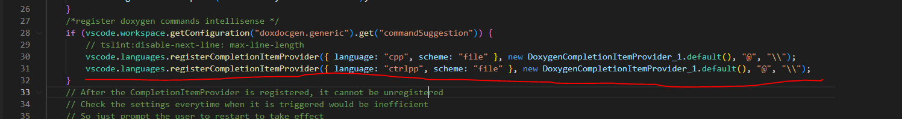
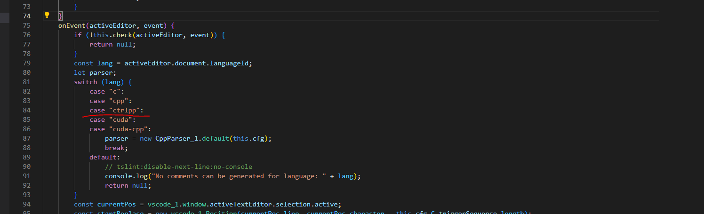

# Kaskad-extpack Fixlne
This extension pack includes a set of extensions for Control development in Visual Studio Code:
* [Doxygen](https://marketplace.visualstudio.com/items?itemName=cschlosser.doxdocgen)
* [Output Colorizer](https://marketplace.visualstudio.com/items?itemName=IBM.output-colorizer)
* [Todo Tree](https://marketplace.visualstudio.com/items?itemName=Gruntfuggly.todo-tree)
* [Better Comments](https://marketplace.visualstudio.com/items?itemName=aaron-bond.better-comments)

## Поправить расширение doxygen
`package.json`
```
"activationEvents": [
		"onLanguage:cuda",
		"onLanguage:cuda-cpp",
		"onLanguage:cpp",
		"onLanguage:ctrlpp",
		"onLanguage:c"
	],
```

`extension.js`



`CodeParserController.js`
